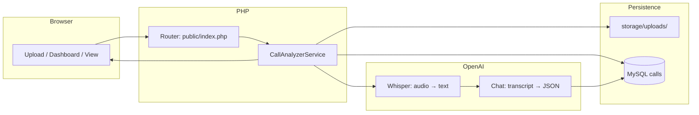
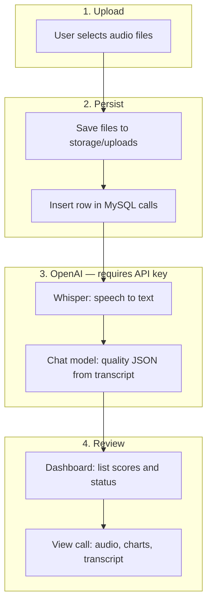
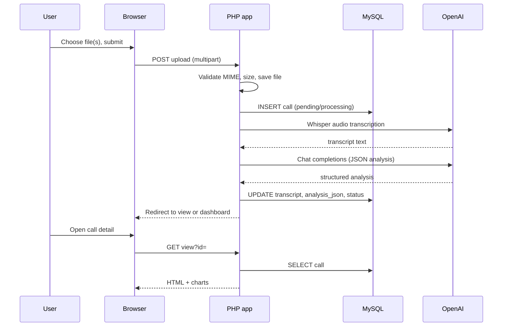

# Call Analyzer

Standalone Core PHP app at **`/var/www/html/call-analyzer`**.

**Features:** upload call recordings → OpenAI Whisper → GPT analysis → **MySQL** + dashboard. Manage data in **phpMyAdmin** (or any MySQL client).

**Prompts** used for AI (system instructions, templates) are documented in **[`PROMPTS.md`](PROMPTS.md)**.  
In the app, open **How it works** in the top navigation for the same process in plain language.

---

## Application workflow

### What happens end-to-end



### Data flow (step by step)



### Request sequence (upload + analyze)



### Routes & actions

| URL / action | Method | Purpose |
|--------------|--------|---------|
| `/?action=dashboard` or `/` | GET | List recent calls, averages, counts |
| `/?action=upload` | GET | Upload form |
| *(same)* | POST | Save files, run pipeline per file |
| `/?action=view&id=` | GET | Call detail: audio, analysis, transcript |
| `/?action=analyze` | POST | Re-run Whisper + analysis (body: `id`) |
| `/?action=audio&id=` | GET | Stream original recording |
| `/?action=help` | GET | “How it works” (in-app help) |

---

## Steps in plain language

| Step | What happens |
|------|----------------|
| 1 | User uploads one or more recordings on **Upload**. |
| 2 | PHP validates type/size, saves files under `storage/uploads/`, creates/updates **`calls`** in MySQL. |
| 3 | If `OPENAI_API_KEY` is set, each file is sent to **Whisper** → **transcript** text. |
| 4 | Transcript is sent to a **chat model** → structured **analysis** (score, sentiment, compliance, summary, etc.). See [`PROMPTS.md`](PROMPTS.md). |
| 5 | Transcript + `analysis_json` stored on the row; status **done** or **error**. |
| 6 | **Dashboard** shows recent calls and average score. |
| 7 | **View** opens the call: playback, charts, checklist, full transcript. **Re-run analysis** repeats steps 3–5 on the same file. |

Without an API key, files are still stored but analysis stays pending / error until you configure `.env`.

---

## Installation

Use this checklist on a new machine or server. **No Composer or Node** — plain PHP only.

### 1. Prerequisites

| Requirement | Notes |
|-------------|--------|
| PHP | **7.4+** (**8.x** recommended for Apache) |
| PHP extensions | `pdo_mysql`, `curl`, `fileinfo`, `json` |
| Database | MySQL **5.7+** or MariaDB **10.3+** |
| Web server | Apache + `mod_php`, or nginx + PHP-FPM, or PHP built-in server (dev only) |
| OpenAI | API key from [platform.openai.com/api-keys](https://platform.openai.com/api-keys) for Whisper + chat |
| **ffprobe** (optional) | Part of **ffmpeg**. Used to read **recording length** and **average call duration**. Without it, duration shows as "—". `sudo apt install ffmpeg` |

### 2. Install system packages (Debian / Ubuntu example)

Adjust PHP version to match what your distro provides (e.g. `php8.2`).

```bash
sudo apt update
sudo apt install apache2 mysql-server php libapache2-mod-php \
  php-mysql php-curl php-xml php-mbstring
sudo systemctl enable --now apache2 mysql
php -m | grep -E 'pdo_mysql|curl|fileinfo|json'
```

If `pdo_mysql` is missing, install the matching package, e.g. `sudo apt install php8.2-mysql` and `sudo systemctl restart apache2` (or `php8.2-fpm` if you use FPM).

### 3. Deploy application files

Copy or clone the project into your web root, e.g.:

```bash
# Example layout: docroot /var/www/html, app in call-analyzer/
cd /var/www/html
# git clone … call-analyzer   # or unpack/copy the folder here
cd call-analyzer
```

### 4. Create database and schema

**Option A — MySQL CLI:**

```bash
sudo mysql -e "CREATE DATABASE IF NOT EXISTS call_analyzer CHARACTER SET utf8mb4 COLLATE utf8mb4_unicode_ci;"
```

Then import the schema (set user/password as needed):

```bash
mysql -u root -p call_analyzer < database/schema.sql
```

**Option B — phpMyAdmin:** open `http://127.0.0.1/phpmyadmin` → **Databases** → create **`call_analyzer`**, collation **`utf8mb4_unicode_ci`** → **Import** → choose **`database/schema.sql`**.

The app also runs `CREATE TABLE IF NOT EXISTS` on startup, but importing once makes the schema easy to review in phpMyAdmin.

### 5. Environment configuration

```bash
cd /var/www/html/call-analyzer   # or your path
cp .env.example .env
```

Edit **`.env`** with your editor. Minimum variables:

| Variable | Example |
|----------|---------|
| `DB_HOST` | `127.0.0.1` |
| `DB_PORT` | `3306` |
| `DB_NAME` | `call_analyzer` |
| `DB_USER` | `root` or a dedicated user |
| `DB_PASSWORD` | your MySQL password |
| `OPENAI_API_KEY` | your OpenAI secret key |

Optional: `OPENAI_CHAT_MODEL`, `OPENAI_WHISPER_MODEL`, `APP_TIMEZONE`, `APP_BASE_PATH` (see `.env.example`).

In phpMyAdmin you can create a MySQL user limited to **`call_analyzer`** with **SELECT, INSERT, UPDATE, DELETE**.

### 6. Storage permissions

The web server user (often **`www-data`**) must be able to write uploads:

```bash
cd /var/www/html/call-analyzer
sudo chown -R www-data:www-data storage
sudo chmod -R ug+rwX storage
# or: bash scripts/fix-storage-permissions.sh
```

### 7. Web server: Apache docroot and assets

With the app at **`/var/www/html/call-analyzer/`** and Apache docroot **`/var/www/html`**:

```bash
sudo ln -sfn /var/www/html/call-analyzer/public/assets /var/www/html/call-analyzer/assets
```

Enable **`AllowOverride All`** (or equivalent) for `/var/www/html` so project **`.htaccess`** / **`.user.ini`** can raise upload limits.

### 8. Post-install checks

1. Open **`http://127.0.0.1/call-analyzer/php-check.php`** — confirm PHP version and **`pdo_mysql: yes`**.
2. Open **`http://127.0.0.1/call-analyzer/`** — you should see the **Dashboard** (after DB + `.env` are correct).

---

## Run the app

Complete **[Installation](#installation)** first. Then open the app using one of the options below.

### Apache at `http://127.0.0.1/call-analyzer/`

Docroot **`/var/www/html`**, project folder **`/var/www/html/call-analyzer/`**. If you did not already create the assets symlink in step 7:

```bash
cd /var/www/html/call-analyzer
ln -sfn public/assets /var/www/html/call-analyzer/assets
```

Open **`http://127.0.0.1/call-analyzer/index.php`** (or `/call-analyzer/` with `DirectoryIndex`).

**Upload “error code 1”:** PHP’s **`upload_max_filesize`** is often **2M**. This project includes **`.htaccess`** / **`.user.ini`** with **64M** limits; ensure **`AllowOverride All`** for `/var/www/html`. If needed, set **`php.ini`**: `upload_max_filesize = 64M`, `post_max_size = 70M`.

**“Could not save uploaded file” / move fails:** the web server user (often **`www-data`**) must write **`storage/uploads/`**. From the project root:

```bash
sudo chown -R www-data:www-data storage
sudo chmod -R ug+rwX storage
# or run: bash scripts/fix-storage-permissions.sh
```

You can upload **multiple** recordings at once (multi-select on the upload page).

### PHP built-in server (dev)

```bash
cd /var/www/html/call-analyzer
php -S 127.0.0.1:8080 -t public public/router.php
```

→ `http://127.0.0.1:8080/`

## Files

| Path | Role |
|------|------|
| `storage/uploads/` | Uploaded audio (not in DB) |
| `database/schema.sql` | Table `calls` for phpMyAdmin import |
| [`PROMPTS.md`](PROMPTS.md) | Human-readable prompt documentation (mirrors [`prompts/*.txt`](prompts/)) |
| [`prompts/analysis_system.txt`](prompts/analysis_system.txt) | **Live** chat system prompt (loaded by the app) |
| [`prompts/transcript_user_prefix.txt`](prompts/transcript_user_prefix.txt) | **Live** user-message prefix before the transcript |
| `src/OpenAiClient.php` | Whisper + chat API calls |

Keep **`.env`** private.

MIT — see `LICENSE`.
